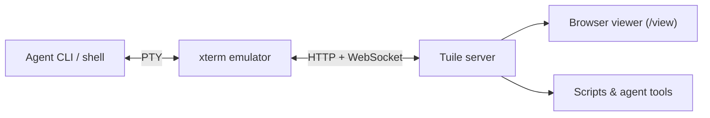
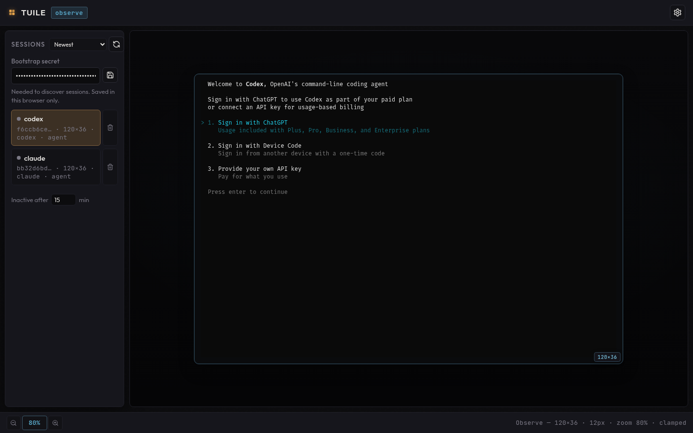
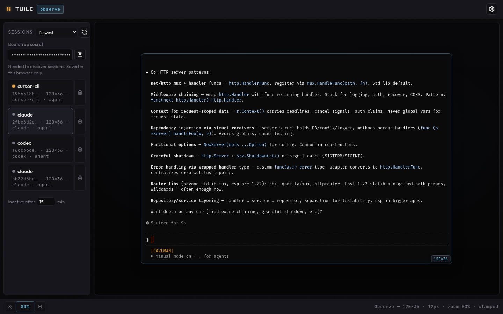
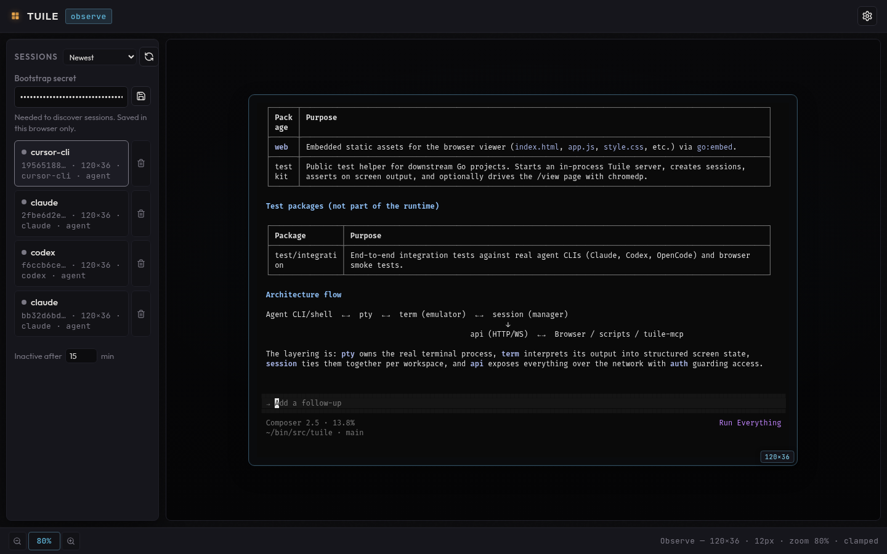
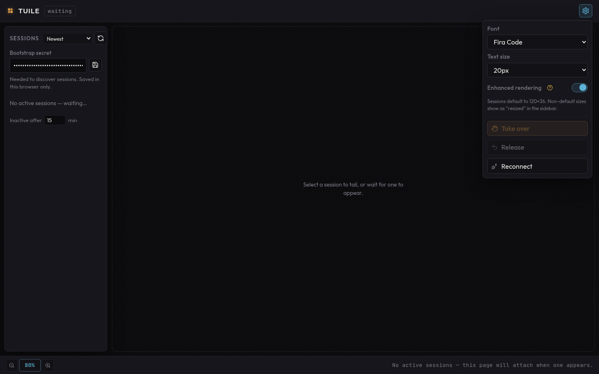

# Tuile

[](https://pkg.go.dev/github.com/newtosh/tuile)
[](https://github.com/newtosh/tuile/actions/workflows/ci.yml)

**Local PTY bridge for terminal UI development.**

Building a TUI? Tuile attaches one real PTY per workspace and exposes it two ways: a **browser viewer** to see what your app actually renders, and a **headless HTTP API** to read screen state, send keystrokes, and wait for output — so you can develop, debug, and test without babysitting a terminal window.

The same bridge works with AI agent CLIs (Claude Code, Codex, Cursor Agent, GitHub Copilot CLI, OpenCode) when you want to observe or automate those full-screen TUIs from scripts, tools, or the built-in viewer.

**Why Tuile?** Terminal apps are hard to share and awkward to script. Tuile keeps a single source of truth (the PTY) while humans watch in the browser and automation drives the structured API. Multiple clients — your test suite, an agent loop, and you — can use the same session.

Typical uses:

- **Develop** — run your TUI locally and watch it render in the browser as you iterate.
- **Observe** — tail Claude, Codex, or Cursor sessions without opening another terminal.
- **Automate** — drive any TUI from a script via `POST /v1/sessions/{id}/input` and `GET /v1/sessions/{id}/screen`.
- **Test** — use the Go `testkit` package to smoke-test your terminal app against an in-process Tuile server in CI.

## TL;DR

| | |
|---|---|
| **What** | Local PTY bridge for TUI dev — headless HTTP API + browser viewer |
| **Build & run** | `make build` → `cp tuile.toml.example tuile.toml` → `./bin/tuile serve --force` |
| **Default URL** | `http://127.0.0.1:7710` |
| **Watch a session** | `http://127.0.0.1:7710/view?session=<id>&token=<token>` |
| **Automate** | `POST /v1/sessions` → `POST .../input` → poll `GET .../screen` or block on `POST .../wait` |
| **Test downstream** | See [docs/testing-with-tuile.md](docs/testing-with-tuile.md) for the Go `testkit` package (`github.com/newtosh/tuile/testkit`) |
| **Install** | `go install github.com/newtosh/tuile/cmd/tuile@latest` — see [docs/adoption.md](docs/adoption.md) |

## Install

```bash
# CLI (pin a release tag in production scripts)
go install github.com/newtosh/tuile/cmd/tuile@v0.1.2
tuile version

# Or download binaries from GitHub Releases
# https://github.com/newtosh/tuile/releases
```

**Downstream Go projects:** `go get github.com/newtosh/tuile@v0.1.2` and import `github.com/newtosh/tuile/testkit` — full guide in [docs/adoption.md](docs/adoption.md).

## How it works



- **Headless API** — poll screen state as JSON, send keystrokes, resize the terminal.
- **Browser viewer** — live xterm.js terminal with session sidebar, colors, and scrollback.
- **One session, many clients** — agents, humans, and automation share the same PTY.

## Browser viewer

The built-in UI at `http://127.0.0.1:7710/` lists active sessions, tails any PTY in observe mode, and lets you switch between agents without opening another terminal. Enter your bootstrap secret once (saved in the browser) to discover sessions created via the API or CLI.

Viewer **fonts**, **terminal color themes**, and **light/dark chrome** are independent settings — see [docs/viewer-themes.md](docs/viewer-themes.md).



*Codex OpenAI sign-in with other agent sessions in the sidebar — switch between CLIs without attaching a second terminal.*



*Claude Code mid-research: the launch welcome screen scrolls away as the timeline fills with output you can watch or automate.*



*Cursor Agent (`cursor-cli`) summarizing the repo — same viewer, same PTY bridge, different agent TUI.*



*Settings panel (gear icon, top right): **App appearance** (Auto/Dark/Light UI chrome), **Terminal theme** (ANSI palette inside the pane), **Font** (bundled Nerd Fonts for statusline icons), and **Text size**; toggle **enhanced rendering** (WebGL) for sharper Unicode and box-drawing; use **Take over** to send keystrokes from the browser, **Release** to hand control back to the agent, and **Reconnect** if the WebSocket drops. Sessions default to 120×36 — non-default sizes show as “resized” in the sidebar.*

## Requirements

- Go 1.26+
- Agent CLIs on `PATH` when using `--cli` (e.g. `claude`, `codex`, `cursor-agent`, `copilot`, `opencode`)

## Setup

```bash
git clone https://github.com/newtosh/tuile.git
cd tuile

make build

cp tuile.toml.example tuile.toml
# Edit bootstrap_secret in tuile.toml (used for session creation and admin APIs)
```

Bootstrap secret resolution (first match wins):

1. `--bootstrap-secret` flag
2. `TUILE_BOOTSTRAP_SECRET` environment variable
3. `bootstrap_secret` in `tuile.toml`
4. Random secret printed on startup

## Run the server

```bash
./bin/tuile serve --force
```

`--force` stops any existing listener on the port before starting. Default listen address is `127.0.0.1:7710`.

## Example use cases

### 1. Shell session in a workspace

```bash
export BOOTSTRAP="your-bootstrap-secret-from-tuile.toml"

curl -s -X POST http://127.0.0.1:7710/v1/sessions \
  -H "Authorization: Bearer $BOOTSTRAP" \
  -H "Content-Type: application/json" \
  -d '{"workspace":"/path/to/project"}' | jq
```

Response includes `session_id` and `token`. Open the viewer:

```
http://127.0.0.1:7710/view?session=<session_id>&token=<token>
```

### 2. Spawn an agent CLI

Supported values for `cli`: `claude`, `codex`, `cursor-cli`, `copilot-cli`, `opencode`.

`opencode` launches the interactive TUI with `--auto` so permission prompts do not block headless agent input (same idea as `--yolo` on cursor/copilot).

```bash
curl -s -X POST http://127.0.0.1:7710/v1/sessions \
  -H "Authorization: Bearer $BOOTSTRAP" \
  -H "Content-Type: application/json" \
  -d '{
    "workspace": "/path/to/project",
    "cli": "cursor-cli",
    "prompt": "check-in"
  }' | jq
```

Or from the CLI (blocks until Ctrl+C):

```bash
./bin/tuile session start --cli codex /path/to/project
```

### 3. Drive a TUI from a script

Send input with `POST /v1/sessions/{id}/input`. A trailing `\n` in JSON is converted to Enter (`\r`) unless `"raw": true`.

```bash
SESSION_ID=...
TOKEN=...

# Type a prompt and submit
curl -s -X POST "http://127.0.0.1:7710/v1/sessions/$SESSION_ID/input" \
  -H "Authorization: Bearer $TOKEN" \
  -H "Content-Type: application/json" \
  -d '{"input":"check-in\n"}'
```

#### Agent loop (token-efficient)

Prefer `format=plain` (raw text + `X-Tuile-Version` header) or `format=compact` (`{"v":…,"t":…}`) over full screen JSON.

```bash
# Send input; response includes screen version for the next poll
curl -s -X POST "http://127.0.0.1:7710/v1/sessions/$SESSION_ID/input" \
  -H "Authorization: Bearer $TOKEN" \
  -H "Content-Type: application/json" \
  -d '{"input":"npm test\n"}' | jq '.version'

# Smallest read: plain text body, version in header (default tail=20)
curl -s -D - "http://127.0.0.1:7710/v1/sessions/$SESSION_ID/screen?format=plain&tail=15" \
  -H "Authorization: Bearer $TOKEN"

# Compact session state (dims + cursor + tail in one call)
curl -s "http://127.0.0.1:7710/v1/sessions/$SESSION_ID/state?format=compact&tail=15" \
  -H "Authorization: Bearer $TOKEN"

# Wait + compact response (one round trip instead of poll loop)
curl -s -X POST "http://127.0.0.1:7710/v1/sessions/$SESSION_ID/wait" \
  -H "Authorization: Bearer $TOKEN" \
  -H "Content-Type: application/json" \
  -d '{"contains":"Tests passed","format":"plain","timeout_ms":60000,"tail":10}'

# Poll only when changed (304 if since version is current)
VERSION=$(curl -s "http://127.0.0.1:7710/v1/sessions/$SESSION_ID/screen?format=compact&tail=5" \
  -H "Authorization: Bearer $TOKEN" | jq '.v')
curl -s -o /dev/null -w "%{http_code}\n" \
  "http://127.0.0.1:7710/v1/sessions/$SESSION_ID/screen?since=$VERSION&format=plain&tail=10" \
  -H "Authorization: Bearer $TOKEN"

# Read structured screen state (full grid — use sparingly)
curl -s "http://127.0.0.1:7710/v1/sessions/$SESSION_ID/screen" \
  -H "Authorization: Bearer $TOKEN" | jq '.screen.lines[-5:]'

# Incremental diff since a prior version (returns 304 if unchanged)
curl -s "http://127.0.0.1:7710/v1/sessions/$SESSION_ID/screen?since=$VERSION" \
  -H "Authorization: Bearer $TOKEN" | jq

# Compact tail text (JSON with version + text only)
curl -s "http://127.0.0.1:7710/v1/sessions/$SESSION_ID/screen?format=text&tail=20" \
  -H "Authorization: Bearer $TOKEN" | jq '.text'

# Block until output contains a marker (server-side wait)
curl -s -X POST "http://127.0.0.1:7710/v1/sessions/$SESSION_ID/wait" \
  -H "Authorization: Bearer $TOKEN" \
  -H "Content-Type: application/json" \
  -d '{"contains":"done","format":"compact","timeout_ms":15000,"tail":10}' | jq

# Per-cell fg/bg/attrs and scroll region metadata
curl -s "http://127.0.0.1:7710/v1/sessions/$SESSION_ID/screen?detail=cells" \
  -H "Authorization: Bearer $TOKEN" | jq '.screen.grid[0]'

# SSE stream of raw PTY output chunks
curl -N "http://127.0.0.1:7710/v1/sessions/$SESSION_ID/stream" \
  -H "Authorization: Bearer $TOKEN"
```

For colored scrollback in the browser or replay, add `?replay=1` to the screen endpoint.

### 4. List and clean up sessions

```bash
# List all sessions
curl -s http://127.0.0.1:7710/v1/sessions \
  -H "Authorization: Bearer $BOOTSTRAP" | jq

# Close one session
curl -s -X DELETE "http://127.0.0.1:7710/v1/sessions/$SESSION_ID" \
  -H "Authorization: Bearer $BOOTSTRAP"
```

## Development

```bash
make test              # unit tests
make vet               # go vet
make race              # race detector
make test-integration  # integration tests (browser tests need Chrome)
make build
```

See [docs/testing-with-tuile.md](docs/testing-with-tuile.md) for the `testkit` package and CI setup for downstream projects. Adoption and metrics: [docs/adoption.md](docs/adoption.md).

Engine spike notes: [docs/spike-u0.md](docs/spike-u0.md)

## Terminal dimensions

Every new session starts at **120×36** (cols×rows). That is the default for shell and agent CLI sessions and matches what the browser viewer expects in observe mode.

Resize is **per session** and persists until the session ends:

```bash
# Default compact response: {"v":…,"c":…,"r":…}
curl -s -X POST "http://127.0.0.1:7710/v1/sessions/$SESSION_ID/resize" \
  -H "Authorization: Bearer $TOKEN" \
  -H "Content-Type: application/json" \
  -d '{"cols":120,"rows":36}'

# Full screen grid after resize (legacy)
curl -s -X POST "http://127.0.0.1:7710/v1/sessions/$SESSION_ID/resize?format=full" \
  -H "Authorization: Bearer $TOKEN" \
  -H "Content-Type: application/json" \
  -d '{"cols":120,"rows":36}'
```

If you want a uniform grid across sessions, either resize each session to the same dims at creation time or close stale sessions (the sidebar marks non-default sizes as `resized`). The browser grid label always reflects the **active** session's PTY size from the server.

## API overview

| Method | Path | Auth | Purpose |
|--------|------|------|---------|
| `GET` | `/health` | — | Health check |
| `GET` | `/view` | session token | Browser terminal viewer |
| `GET` | `/v1/sessions` | bootstrap | List sessions |
| `POST` | `/v1/sessions` | bootstrap | Create session |
| `DELETE` | `/v1/sessions/{id}` | bootstrap | Close session |
| `GET` | `/v1/sessions/{id}/state` | session token | Compact summary: dims, cursor, tail text (`?format=plain\|text\|compact`, `?tail=N`) |
| `GET` | `/v1/sessions/{id}/screen` | session token | Screen snapshot (`?since=`, `?detail=cells`, `?format=plain\|text\|compact`, `?tail=N`, `?region=y1:y2`) |
| `POST` | `/v1/sessions/{id}/wait` | session token | Block until text match or version change (`format` in body: plain, text, compact) |
| `GET` | `/v1/sessions/{id}/stream` | session token | SSE stream of PTY output |
| `POST` | `/v1/sessions/{id}/input` | bootstrap or session | Write PTY input (returns `{"version"}`) |
| `POST` | `/v1/sessions/{id}/resize` | session token | Resize terminal (default `format=compact`: `{"v","c","r"}`; `?format=full` includes screen) |
| `POST` | `/v1/sessions/{id}/takeover` | session token | Human takes PTY control |
| `POST` | `/v1/sessions/{id}/release` | session token | Return control to agent |
| `GET` | `/v1/sessions/{id}/ws` | session token | Live terminal WebSocket |

## Threat model

Tuile bridges a **real local shell** to HTTP and WebSocket clients.

- **Default bind** is loopback (`127.0.0.1:7710`). Use `--listen` deliberately for LAN access.
- **Non-loopback exposure** should use TLS (`--tls-cert` / `--tls-key`) or a reverse proxy with WSS.
- **Bearer tokens** are session credentials. A stolen token grants user-level shell access (RCE at the invoking user's privilege). Never log tokens; treat `tuile.toml` bootstrap secrets like passwords.
- **Origin allowlist** is default-deny for browser WebSockets. Misconfiguration can enable CSWSH-style attacks (see ttyd/GoTTY precedents in the implementation plan).
- **Do not run as root.** The server refuses to start as root unless `--allow-root` is passed for local development.

## License

MIT — see [LICENSE](LICENSE). Third-party components are listed in [NOTICES.md](NOTICES.md).

## Contributing

See [CONTRIBUTING.md](CONTRIBUTING.md). Security reports: [SECURITY.md](SECURITY.md).
