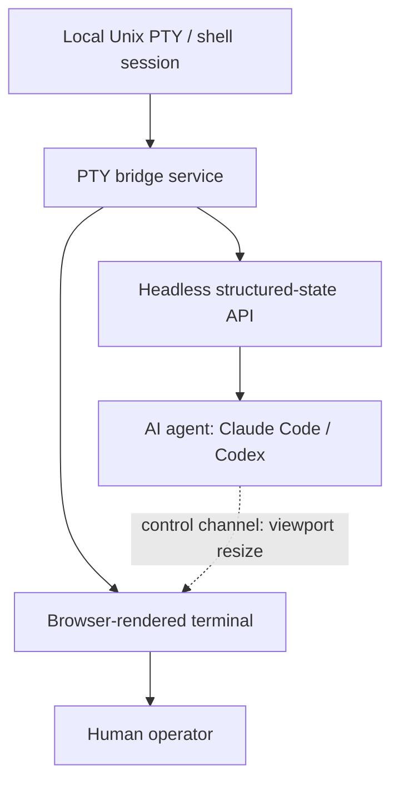
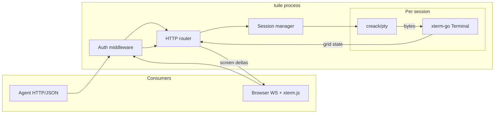

# Tuile - Plan

## Goal Capsule

- **Objective:** Give AI coding agents (starting with Claude Code and Codex) a reliable way to build, drive, and verify a terminal TUI session without a human eyeballing a rendered terminal, while giving humans a real browser-based terminal with full viewport/font/ligature control over the same session.
- **Product authority:** This brainstorm.
- **Open blockers:** None — OQ1 (auth mechanism) resolved in Planning Contract KTD1.
- **Execution profile:** Phase A (agent path) ships before Phase B (browser viewer). U0 engine spike gates U3+.
- **Stop conditions:** Abort implementation if U0 fails grid-parity against browser xterm.js for Claude Code and Codex sample screens; do not proceed on mismatched dual-consumer state.

---

## Product Contract

**Product Contract preservation:** Unchanged except R14 and clarifications added during doc review (concurrent access, MVP phasing, render-verification scope, ligature deferral). No requirement IDs removed.

### Summary

A standalone service bridges one real local Unix PTY session into two consumer surfaces from a single source of truth: a headless structured-state API that AI agents read and drive directly, and a browser-rendered terminal that gives humans full interactive control over viewport, fonts, and ligatures. MVP targets Claude Code and Codex; Copilot CLI, opencode, and Cursor Agent CLI follow once their TUI internals are confirmed.

### Problem Frame

Agents working on TUI applications have no reliable way to confirm a rendering change actually worked short of a human looking at a terminal. This blocks autonomous build/test/render loops. The gap is real and distinct from ordinary output-correctness testing: GitHub Copilot CLI issue #1805 documents a rendering-specific bug ("rocket scroll") that only shows up inside a browser terminal, not in any structured output check. No existing tool gives an agent a reliable, non-visual way to catch this class of problem on a real, already-running CLI binary.

**Scope of agent verification (MVP):** The headless structured-state path targets PTY/grid/layout correctness — cursor position, cell content, scroll regions, reflow after resize — not browser-renderer artifacts (WebGL scroll quirks, font rasterization, ligature shaping). Browser-only defects like #1805 remain human-viewer or deferred visual-regression scope unless a future acceptance example proves structured-state detection.

### Key Decisions

- **Standalone reusable service, not tied to a single downstream consumer** (session-settled: user-directed — chosen over an internal dev/test tool bundled inside one TUI project or a project-specific `serve` mode when both were offered alongside this option).
- **Headless structured-state API is the agent's primary path; browser rendering is secondary and human-facing** (session-settled: user-directed — chosen over the original framing of Playwright driving the rendered browser terminal as the agent's primary interface, after research showed the WebGL renderer needed for performance is opaque to Playwright's accessibility tree, and an open, unresolved xterm.js bug (#5154) shows Playwright itself breaks WebGL rendering in Chromium and Firefox. Every comparable "agent reads/drives a terminal" tool found in research — termless, tui-use, agent-tui, pilotty — already skips the browser for exactly this reason).
- **Ligature and font fidelity are human-viewer polish, not an agent-correctness requirement.** This decouples the hardest, most fragile rendering problem — `xterm-addon-ligatures` needs filesystem font access, only works on the slower Canvas renderer (not WebGL), and its repo is archived — from the agent-facing critical path.
- **MVP CLI scope is Claude Code and Codex only** (session-settled: user-directed — chosen over supporting all five named CLIs from day one). These two have the most-verified underlying TUI frameworks (Ink+Yoga and Ratatui+crossterm respectively), so the control layer gets validated against two genuinely different frameworks without betting on unconfirmed internals for opencode or Cursor.
- **CSWSH-class security is a v1 hard requirement, not deferred.** Bridging a live local shell over a WebSocket is the same vulnerability class that produced a real pre-1.3.0 ttyd CVE (auth bypass on raw input) and a full-host RCE in a root-deployed GoTTY instance. The browser channel being "secondary" does not reduce this exposure.
- **PTY bridge implemented in Go, using `creack/pty`** (session-settled: user-directed — chosen over Node's `node-pty` and Rust's `portable-pty` when offered alongside this option). Matches common Go TUI project stacks for future integration fit.



### Requirements

**Core PTY bridge**

- R1. The service attaches one real local Unix PTY/shell session per **workspace** (the caller-provided working-directory root for the shell session) and exposes it as the single source of truth for both consumer paths below.
- R2. Terminal resize (viewport change) propagates to the underlying PTY as a real resize signal, not a cosmetic client-side reflow.

**Agent-facing headless API**

- R3. Agents read and write the terminal session through a structured, non-visual API (per-cell grid state, cursor position, raw output stream) without needing a browser or any pixel/screenshot-based reading.
- R4. The headless API works at the PTY/byte level, independent of which TUI framework the attached agent CLI happens to use. **At MVP, reliable attach/drive semantics are validated only for R12–R13 targets**; framework-agnostic claims beyond those CLIs await post-MVP research (OQ2).
- R5. The headless API lets an agent send input and read output deterministically enough to detect whether a build/test/render step succeeded or failed. **Render verification means observable changes in structured terminal state** (grid layout, cursor position, scroll regions, cell attributes) — not browser pixel fidelity or font/ligature shaping.

**Human-facing browser terminal**

- R6. A browser-rendered terminal view attaches to the same PTY session an agent may be driving, so a human can watch or take over.
- R7. The browser view supports user-driven control of viewport size, font family, and ligature rendering. **Ligature controls may be present before ligature-addon rendering ships; MVP human viewer requires working fonts with ligatures explicitly optional/degraded until deferred polish lands.**
- R8. The browser view supports **agent-driven viewport resize** through the same control channel used for R3–R5 (PTY-level resize per R2). Agent-driven font/ligature changes are **deferred post-MVP** — they are human-viewer polish, not agent-correctness requirements.
- R14. When agent (A1) and human (A2) are simultaneously connected to the same PTY session, the service defines concurrent-access semantics: **default observe-only for humans** (no PTY input until explicit takeover), **input routing during takeover** (human writes take precedence; agent input is queued or rejected with a visible conflict signal), and **resize authority** (PTY resize follows the active controller; cosmetic font changes do not alter PTY dimensions).

**Security**

- R9. The service authenticates every connection, agent and browser alike, with non-ambient credentials — no reliance on cookies or "localhost-only" as a security boundary. **When the bridge is reachable over the network, all agent and browser channels use encrypted transport (WSS/TLS or equivalent); plaintext is permitted only for explicitly documented local-only transports (e.g. Unix domain socket).**
- R10. The service validates the request Origin on every WebSocket upgrade to prevent cross-site WebSocket hijacking. **Origin allowlist is default-deny, explicitly configured, and rejects missing or non-matching Origin before any PTY bytes flow.**
- R11. The service never runs the PTY bridge process as root.

**CLI support (MVP)**

- R12. The service reliably **spawns** a Claude Code session in a fresh PTY and drives it through the headless API. Attach-to-already-running semantics are post-MVP unless planning proves otherwise.
- R13. The service reliably **spawns** a Codex CLI session in a fresh PTY and drives it through the headless API. Attach-to-already-running semantics are post-MVP unless planning proves otherwise.

### Actors

- A1. **AI coding agent** — drives the terminal session through the headless API (R3-R5); starting with Claude Code and Codex (R12-R13).
- A2. **Human operator** — views and/or interacts with the same session through the browser terminal (R6, R7, R8 viewport resize via agent only).
- A3. **PTY bridge service** — mediates both consumer paths against one real local Unix shell session and enforces the security boundary (R9-R11).

### Key Flows

- F1. Agent-driven build/test/render loop
  - **Trigger:** An agent (Claude Code or Codex) needs to build, run, or verify a TUI change.
  - **Actors:** A1, A3
  - **Steps:** Agent authenticates to the PTY bridge service; sends input via the headless API; reads back structured terminal state to confirm success or failure, with no screenshot or pixel parsing; may adjust viewport dimensions on the browser view via the same control channel when a resize-sensitive test requires it.
  - **Covers:** R3, R4, R5, R8, R9, R12, R13, R14

- F2. Human observes or takes over a live agent session
  - **Trigger:** A human wants to watch an agent work, or intervene, in a session an agent is actively driving.
  - **Actors:** A2, A3
  - **Steps:** Human authenticates with non-ambient credentials; browser WebSocket upgrade validates Origin against the allowlist; human opens the browser terminal against the same PTY session in **observe-only mode** (live output, no PTY input); human may **explicitly take over** to send input (per R14); browser renders live output with the human's chosen viewport/font/ligature settings.
  - **Covers:** R6, R7, R1, R9, R10, R14

### Acceptance Examples

- AE1. **Covers R3, R5.** Given an agent sends a build command through the headless API, when the underlying process exits non-zero, then the agent's structured read reflects the failure without parsing any rendered pixels.
- AE5. **Covers R5.** Given a TUI layout change after viewport resize, when the agent reads structured terminal state, then cell positions or scroll regions reflect the expected reflow (not merely unchanged raw byte stream).
- AE2. **Covers R9, R10.** Given a browser tab from an unrelated origin attempts to open a WebSocket to the bridge, when the Origin header doesn't match the allowlist, then the connection is rejected before any PTY data is exchanged.
- AE3. **Covers R2, R7.** Given a human resizes the browser terminal viewport, when the resize event fires, then the underlying PTY receives the equivalent resize and the attached TUI app (e.g. Codex) reflows correctly.
- AE4. **Covers R2, R8.** Given an agent sets viewport dimensions through the headless control channel, when the resize is applied, then the underlying PTY receives the equivalent resize and structured reads reflect the reflowed grid state.

### Success Criteria

- An agent completes a full build/test/render verification loop against a live TUI app using only the headless API — no human needed to confirm a **structured-state** rendering/layout claim during that loop.
- A human can open the same session in a browser and see or take over what the agent was doing, with **working font rendering; ligatures optional/degraded in MVP** per deferred scope, not a broken viewer.
- No credential or session data is exposed to a cross-origin WebSocket connection attempt.

### Scope Boundaries

**MVP delivery sequence**

1. **Phase A (agent path):** R1–R5, R9–R11, R12–R13, R14 — PTY bridge, headless API, security, concurrent-access semantics, CLI spawn+drive.
2. **Phase B (human viewer):** R6–R8, R7 font controls — browser terminal attach, observe/takeover, viewport/font controls.
3. **Polish (post-MVP):** ligature-addon rendering, agent-driven font/ligature, attach-to-running semantics, visual regression.

**Deferred for later**

- Copilot CLI, opencode, and Cursor Agent CLI support — opencode's and Cursor's underlying TUI frameworks are unconfirmed from public sources (opencode: BubbleTea vs. a custom Zig "OpenTUI" is contested across sources; Cursor: unconfirmed by any primary source) and need direct investigation before committing to an integration approach.
- Browser-side visual regression / screenshot testing — a real bug class (see Copilot CLI issue #1805 in Problem Frame) but not required for the agent's primary correctness path.
- Ligature-addon-based Canvas rendering — deferred until the human-viewer experience is being polished, not on the MVP critical path.

**Outside this product's identity**

- Playwright/accessibility-tree-driven agent vision as the primary agent interface — rejected per Key Decisions. Every comparable tool converged on skipping the browser for agent reads, and Playwright has an open, unresolved bug breaking WebGL rendering outright.

### Dependencies / Assumptions

- Assumes `creack/pty` remains maintained and sufficient for the Go-based PTY bridge (Key Decisions).
- Assumes a headless terminal-emulator engine can serve as the structured-state backbone for the agent-facing API with grid parity to the browser xterm.js consumer — validated in U0 before Phase A continues.
- Assumes Claude Code's and Codex's existing non-interactive/print modes are not a substitute for this service — those modes bypass the visual/interactive TUI layer entirely rather than making it verifiable, which is what this service targets.

### Outstanding Questions

**Deferred to implementation**

- OQ2. Whether opencode's and Cursor Agent CLI's TUI internals need a dedicated research spike before extending past MVP, or whether MVP CLI support (R12-R13) already proves the control layer framework-agnostic enough to extend without new research.

### Sources / Research

- xterm.js GitHub issue #5154 — open, unresolved: Playwright breaks WebGL rendering in Chromium and Firefox.
- GitHub Copilot CLI issue #1805 — documented "rocket scroll" rendering bug specific to running inside xterm.js-based browser terminals.
- Comparable agent-terminal tools: termless, tui-use, agent-tui, pilotty.
- ttyd (pre-1.3.0 auth bypass) and GoTTY (root-deployment RCE) — CSWSH-class precedent for R9-R11.
- [gitpod-io/xterm-go](https://github.com/gitpod-io/xterm-go) — pure-Go xterm.js headless port with conformance tests; primary engine candidate (KTD2).
- `@xterm/headless` — fallback if xterm-go spike fails; requires Node sidecar.
- Ghostty / `libghostty-vt` — embeddable VT core; CGo fallback if both xterm paths fail U0.
- Textual Pilot — framework-native headless export; non-goal for Claude/Codex PTY sessions.
- Claude Code: Ink + Yoga; Codex CLI: Ratatui + crossterm (`codex-rs/tui`).

---

## Planning Contract

### Summary

Tuile is a greenfield Go binary that owns PTY lifecycle, terminal emulation state, auth, and fan-out to agent (HTTP/JSON + optional Unix socket) and human (WebSocket + static xterm.js UI) consumers. One `xterm.Terminal` instance per session feeds both consumers from the same PTY byte stream. Phase A delivers the agent loop; Phase B adds the browser viewer.

### Key Technical Decisions

- **KTD1. Session-scoped bearer tokens with explicit scopes** — resolves OQ1. On session create, mint an opaque bearer token (32+ bytes, URL-safe) bound to `session_id`, `workspace`, and scopes (`agent:read`, `agent:write`, `human:view`, `human:control`). Agent clients send `Authorization: Bearer <token>` on every HTTP and WebSocket request. Browser clients pass the token as a query parameter on the WebSocket URL (never HttpOnly cookies). Tokens expire on session end or configurable TTL (default 24h). Reject connections before PTY attach when token is missing, expired, or scope-insufficient.

- **KTD2. `gitpod-io/xterm-go` as the shared terminal emulator** (session-settled: user-approved — chosen over `@xterm/headless` Node sidecar and `libghostty-vt` CGo after planning research: pure Go, xterm.js conformance tests, single binary, pairs with browser xterm.js). U0 validates; if conformance fails for Ink/Ratatui samples, fall back to Node `@xterm/headless` sidecar (KTD2b).

- **KTD3. Single Go process, no root** (session-settled: user-directed — inherits Product Contract). Drop privileges at startup if invoked via sudo; refuse to start when euid is 0 unless `--allow-root` dev flag (off by default).

- **KTD4. `github.com/coder/websocket` for browser WebSocket** — modern API, explicit Origin handling, used by comparable Go terminal libraries (vterm). TLS termination via reverse proxy in production; built-in `tuile serve --tls-cert/--tls-key` for local dev WSS.

- **KTD5. Concurrent access: observe-default, explicit human takeover** — implements R14. Human browser attaches in `view` scope; `POST /sessions/{id}/takeover` upgrades to `human:control`. Agent writes rejected with HTTP 409 + structured error while human controls. Resize: active controller wins; on release, restore last agent-requested size if set.

- **KTD6. CLI spawn, not attach** — implements R12/R13 planning choice. `tuile session start --cli claude|codex` spawns the binary found on `PATH` in the session workspace PTY.

### High-Level Technical Design



**PTY read loop:** dedicated goroutine reads PTY → writes to `xterm-go` → broadcasts raw bytes to WS clients and increments structured-state version for headless poll clients.

**Headless read path:** `GET /v1/sessions/{id}/screen` returns JSON grid (cols, rows, cursor, cells with fg/bg/attrs, scroll region metadata). Optional `?since=<version>` for incremental diff.

**Input path:** `POST /v1/sessions/{id}/input` (agent) and WS binary frames (human, when controlling) → concurrency gate → PTY write.

### Output Structure

```text
tuile/
  cmd/tuile/main.go
  internal/
    auth/token.go
    config/config.go
    pty/master.go
    session/manager.go
    session/concurrency.go
    term/emulator.go          # xterm-go wrapper
    api/router.go
    api/headless.go
    api/browser_ws.go
    cli/drivers.go            # claude, codex spawn
  web/
    index.html
    app.js                    # xterm.js + WS client
    package.json
  go.mod
  go.sum
  Makefile
  README.md
  internal/..._test.go
  test/integration/
```

### Assumptions

- Claude Code and Codex binaries are on `PATH` when integration tests run (skip if missing).
- Agents consume JSON over HTTP; no gRPC in MVP.
- One session per workspace per tuile process instance; multi-session manager is in-scope but one PTY each.

### Sequencing

U0 → U1 → U2 → U3 → U4 → U5 (Phase A complete) → U6 (Phase B) → U7 (verification hardening).

---

## Implementation Units

### U0. Engine spike and repo bootstrap

- **Goal:** Prove `xterm-go` grid parity with browser xterm.js for representative Claude Code and Codex terminal output; scaffold the Go module.
- **Requirements:** R3, R4, R5 (feasibility); Dependency assumption on headless engine.
- **Dependencies:** None.
- **Files:** `go.mod`, `go.sum`, `cmd/tuile/main.go`, `internal/term/emulator.go`, `internal/term/spike_test.go`, `Makefile`, `README.md`
- **Approach:** Capture golden PTY transcripts (or synthetic ANSI sequences mimicking Ink/Ratatui layouts) in testdata. Feed through `xterm-go` and through a minimal Node script using `@xterm/headless` + serialize addon; assert cell grids match within defined tolerance. Document fallback decision.
- **Execution note:** Spike must complete before U3; failing spike blocks Phase A and triggers KTD2b evaluation.
- **Patterns to follow:** `gitpod-io/xterm-go` conformance test layout.
- **Test scenarios:**
  - Happy path: 80x24 grid with colored TUI frame parses to expected cell matrix.
  - Resize reflow: AE5-shaped sequence — after `CSI t` resize, cursor and line wrap positions match golden.
  - Alt-screen: switch to alternate buffer and back preserves expected active buffer.
  - Error path: malformed UTF-8 in PTY stream does not crash emulator.
- **Verification:** `go test ./internal/term/...` passes; spike report recorded in U0 commit message or `docs/plans/` appendix note.

### U1. PTY session manager

- **Goal:** Create and manage one PTY per workspace with resize propagation (R1, R2).
- **Requirements:** R1, R2.
- **Dependencies:** U0.
- **Files:** `internal/pty/master.go`, `internal/session/manager.go`, `internal/config/config.go`, `internal/session/manager_test.go`
- **Approach:** `SessionManager` maps `session_id` → `{workspace, pty, emulator, cols, rows}`. `Resize(cols, rows)` issues `TIOCSWINSZ` via creack/pty and updates emulator dimensions.
- **Test scenarios:**
  - Happy path: start session with workspace dir, verify shell pwd matches.
  - Resize: change cols/rows, verify PTY winsize and emulator dimensions update.
  - Edge case: resize to minimum 2x2 rejected or clamped per POSIX expectations.
  - Error path: invalid workspace path returns clear error without leaking PTY.
- **Verification:** Unit tests pass; manual smoke `tuile session start` shows shell in workspace.

### U2. Auth, transport, and Origin policy

- **Goal:** Implement R9–R11 and KTD1/KTD4 — bearer auth, TLS/WSS option, default-deny Origin on WebSocket.
- **Requirements:** R9, R10, R11; AE2.
- **Dependencies:** U1.
- **Files:** `internal/auth/token.go`, `internal/api/router.go`, `internal/auth/token_test.go`, `internal/api/origin_test.go`
- **Approach:** Token minted at session create; middleware validates Bearer header or `?token=` on WS. `AllowedOrigins` config slice; reject WS upgrade when `Origin` missing or not in list. Refuse root unless dev flag.
- **Test scenarios:**
  - Covers AE2: WS upgrade from disallowed Origin rejected before session attach.
  - Happy path: valid bearer on headless route succeeds.
  - Error path: expired token rejected; missing scope returns 403.
  - Edge case: empty Origin allowlist rejects all browser WS (fail-closed default).
- **Verification:** `go test ./internal/auth/... ./internal/api/...`; AE2 integration test in U7.

### U3. Headless structured-state API

- **Goal:** Agent-facing read/write API (R3–R5) over HTTP JSON.
- **Requirements:** R3, R4, R5; F1; AE1, AE4, AE5.
- **Dependencies:** U0, U1, U2.
- **Files:** `internal/api/headless.go`, `internal/term/emulator.go`, `internal/api/headless_test.go`
- **Approach:** Endpoints: `POST /v1/sessions/{id}/input`, `GET /v1/sessions/{id}/screen`, `POST /v1/sessions/{id}/resize`, `GET /v1/sessions/{id}/stream` (optional SSE of raw bytes). Screen JSON exposes per-cell state per R3.
- **Execution note:** Implement screen snapshot tests before wiring CLI drivers (U5).
- **Test scenarios:**
  - Covers AE1: non-zero exit reflected in structured read (shell command).
  - Covers AE5: resize then read shows reflowed grid.
  - Covers AE4: agent resize endpoint updates PTY and screen state.
  - Error path: read without `agent:read` scope returns 403.
- **Verification:** Headless API integration tests pass without browser.

### U4. Concurrent access controller

- **Goal:** Implement R14 observe/takeover semantics and resize authority (KTD5).
- **Requirements:** R14; F1, F2.
- **Dependencies:** U2, U3.
- **Files:** `internal/session/concurrency.go`, `internal/session/concurrency_test.go`, `internal/api/headless.go`, `internal/api/browser_ws.go`
- **Approach:** Session holds `controller: agent|human|none` and input queue. Human takeover endpoint flips controller; agent input returns 409 when human controls.
- **Test scenarios:**
  - Happy path: human in observe mode cannot write; agent can.
  - Takeover: after takeover, human write reaches PTY; agent write gets 409.
  - Resize authority: human resize during takeover updates PTY; agent resize rejected until release.
  - Edge case: concurrent resize from both sides resolves per KTD5 last-controller-wins.
- **Verification:** Concurrency unit tests; F2 flow exercised in U7.

### U5. Claude Code and Codex CLI drivers

- **Goal:** Spawn and drive R12/R13 targets through headless API.
- **Requirements:** R12, R13; R4 (MVP validation).
- **Dependencies:** U3, U4.
- **Files:** `internal/cli/drivers.go`, `internal/cli/drivers_test.go`, `test/integration/claude_test.go`, `test/integration/codex_test.go`
- **Approach:** `drivers.Spawn(cli, workspace)` resolves binary (`claude`, `codex`), args for interactive TUI mode, env inheritance. Integration tests skip when binary absent.
- **Test scenarios:**
  - Happy path (Claude): spawn session, send newline, read structured prompt region non-empty.
  - Happy path (Codex): spawn session, verify Ratatui-style frame cells present after startup timeout.
  - Error path: missing binary returns actionable error.
  - Edge case: CLI exits early — structured read reports shell prompt or exit status.
- **Verification:** Integration tests pass when CLIs installed; documented skip otherwise.

### U6. Browser terminal viewer (Phase B)

- **Goal:** Human-facing xterm.js UI with observe/takeover, viewport/font controls (R6–R8, R7).
- **Requirements:** R6, R7, R8; F2; AE3.
- **Dependencies:** U4, U2.
- **Files:** `web/index.html`, `web/app.js`, `web/package.json`, `internal/api/browser_ws.go`, `test/integration/browser_test.go`
- **Approach:** Static assets served by Go embed or `web/` file server. WS protocol: server→client PTY bytes + screen version; client→server input only when `human:control`. Font family via xterm `setOption`; ligature toggle stub with degraded notice until addon lands. Takeover button calls REST takeover endpoint.
- **Test scenarios:**
  - Covers AE3: browser resize propagates to PTY (Playwright or chromedp integration test).
  - Happy path: observe mode shows live output without accepting keys.
  - Error path: auth failure and bad Origin show user-visible error state (connecting/failed/reconnect).
  - Edge case: reconnect replays scrollback via xterm-go serialize snapshot.
- **Verification:** Browser integration test passes in CI when headless Chrome available.

### U7. End-to-end verification harness

- **Goal:** Prove Success Criteria for Phase A+B with automated tests mapping to AEs.
- **Requirements:** All R1–R14 success paths; Success Criteria.
- **Dependencies:** U5, U6.
- **Files:** `test/integration/e2e_test.go`, `Makefile` (targets `test`, `test-integration`)
- **Approach:** Single test binary orchestrates: start session → agent loop (headless only) → open browser → human observe → optional takeover → assert no cross-origin leak (AE2).
- **Test scenarios:**
  - Full F1 agent loop without browser.
  - F2 human observe then takeover on live agent session.
  - Security: token from session A cannot access session B.
- **Verification:** `make test-integration` green in dev environment with CLIs present.

---

## Verification Contract

| Gate | Command | When |
|------|---------|------|
| Unit tests | `go test ./...` | Every unit, every PR |
| Race detector | `go test -race ./...` | U4+ changes |
| Integration | `make test-integration` | U5+, before Phase A sign-off |
| Browser integration | `make test-browser` (Playwright/chromedp) | U6+, Phase B sign-off |
| Lint | `go vet ./...` | Every PR |
| Manual smoke | `tuile serve` + `tuile session start --cli codex` + curl screen endpoint | Phase A demo |

**Phase A exit:** U0–U5 complete; AE1, AE4, AE5, AE2 (API-level) pass; F1 runnable without browser.

**Phase B exit:** U6–U7 complete; AE3 passes; F2 observe/takeover demonstrated.

---

## Definition of Done

**Global**

- All Implementation Units U0–U7 marked complete by verification gates above.
- No process runs as root in default configuration (R11).
- README documents: install, `tuile serve`, session create, agent API examples, browser URL, auth token handling, Origin allowlist config.
- Product Contract preservation note still accurate.

**Per unit**

| Unit | Done when |
|------|-----------|
| U0 | Spike pass/fail documented; `go test ./internal/term` green |
| U1 | Session create/resize/kill works via CLI |
| U2 | AE2 API test passes; root refusal tested |
| U3 | AE1, AE4, AE5 automated |
| U4 | Takeover 409/200 semantics tested |
| U5 | Claude and Codex integration tests pass or skip with documented reason |
| U6 | Browser attaches, AE3 passes, error states render |
| U7 | E2E F1+F2 harness green |

**Cleanup:** Remove spike-only throwaway scripts and experimental flags before declaring MVP complete.

---

## System-Wide Impact

- **Security boundary:** Tuile exposes a local shell to the network if misconfigured. Default bind `127.0.0.1`, require explicit `--listen` for LAN, mandate TLS for non-loopback, document threat model (stolen token = user-level RCE).
- **Agent tooling:** Headless JSON API becomes the integration surface for Claude Code/Codex agent loops — document stable `/v1/` paths; breaking changes require version bump.
- **Future library embedding:** Standalone module layout (`internal/session`, `internal/api`) allows embedding as a library later without rewriting PTY layer.

---

## Risks & Dependencies

| Risk | Mitigation |
|------|------------|
| xterm-go fails Ink/Ratatui parity | U0 spike; fallback KTD2b Node sidecar or libghostty-vt |
| Claude/Codex CLI flags change | Pin tested versions in integration tests; `--version` probe |
| CSWSH misconfiguration | Default-deny Origin; integration test AE2; document ttyd CVE lessons |
| Dual-consumer state drift | Single emulator instance per session; browser consumes same PTY bytes |
| Token leakage via logs | Never log bearer tokens; redact query params in access logs |

**External deps:** `github.com/creack/pty`, `github.com/gitpod-io/xterm-go`, `github.com/coder/websocket`, xterm.js (npm, browser only).

---

## Open Questions

- **OQ2 (deferred):** Extend CLI support after MVP — revisit once R12/R13 integration tests characterize framework differences.
