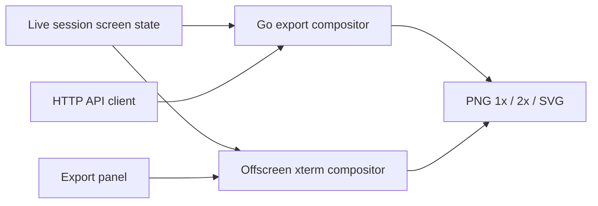

# Terminal Screenshot Export - Plan

## Goal Capsule

- **Objective:** Let Tuile users turn live session terminal state into polished, shareable images for README/docs and release/social posts — with wireframe window chrome, flexible backgrounds, and consistent output from both the browser viewer and the HTTP API.
- **Product authority:** This brainstorm.
- **Open blockers:** None.
- **Execution profile:** Four units — shared export model, server compositor + API, browser compositor + panel, tests/docs. Server and browser compositors share presets; parity is content-level, not pixel-identical.
- **Stop conditions:** Abort if offscreen xterm replay cannot render box-drawing sessions used in README examples; do not ship API-only with no viewer export path.

---

## Planning Contract

**Product Contract preservation:** R9 clarified — API custom background via multipart upload (not URL fetch). Outstanding Questions resolved into KTDs and unit specs below; no product-scope change.

### Key Technical Decisions

- KTD1 — **Shared `ExportOptions` JSON schema** (`internal/export/options.go` + mirrored constants in `web/export-options.js`). Chrome preset IDs (`minimal`, `os-wireframe`), background mode (`transparent`, `preset`, `custom`), scale (`1`, `2`), format (`png`, `svg`), and theme fields (`font_family`, `font_size_px`, `theme` — `dark`/`light` or viewer snapshot) are the single contract for viewer and API.
- KTD2 — **Server compositor (Go)** — authoritative for `POST /v1/sessions/{id}/export`. Rasterize from `ScreenSnapshot` with `detail=cells` (`?detail=cells` on the existing screen handler pattern). Compose chrome and background in Go (`image/draw`, `golang.org/x/image/font` with bundled monospace). No headless Chromium on the server.
- KTD3 — **Browser compositor (offscreen xterm)** — authoritative for viewer-initiated download. Hidden `Terminal` instance replays `replay_b64` from `GET .../screen?replay=1`, draws to canvas, composites chrome/background layers in `web/export-compositor.js`. WYSIWYG-aligned with live viewer; does not scrape the visible terminal canvas.
- KTD4 — **Dual paths, content parity** (session-settled: user-approved — chosen over single server-only path: scoping confirmed browser WYSIWYG plus API automation). Integration tests assert matching line text and representative ANSI colors between paths; pixel-identical cross-path output is not required (per Product Contract assumptions).
- KTD5 — **`POST /v1/sessions/{id}/export`** — JSON body for options; `multipart/form-data` when `background_mode=custom` (field `background_image`, max 2 MiB, PNG/JPEG/WebP). Response `Content-Type: image/png` or `image/svg+xml`; `Content-Disposition: attachment` with generated filename. Auth: session token (same as screen) or bootstrap for owned sessions.
- KTD6 — **SVG v1 = cell-grid SVG** — one `<text>` or `<tspan>` per cell row segment with `font-family: monospace`; box-drawing characters as literal text. No embedded raster inside SVG for v1. PNG remains the fidelity fallback for social posts.
- KTD7 — **Current snapshot only** — export captures the session's live screen at request time. No scrollback region picker or historical version selector in v1.
- KTD8 — **ANSI palette mapping** — server compositor maps `CellSnapshot` `pN` palette indices and `#rrggbb` RGB to fixed dark-theme colors matching xterm.js defaults; document mapping in `internal/export/palette.go`.

### Assumptions

- `replay_b64` and `detail=cells` reflect the same session state at export time; race with live PTY output is acceptable (snapshot moment).
- Viewer export panel reads current `#font-family`, `#font-size`, and xterm theme from `web/app.js` state when building default `ExportOptions`.
- Custom background images are decoded server-side only for API multipart; browser compositor uses `FileReader` locally without uploading unless user also hits API.

### Sequencing

1. U1 — export options + chrome/background preset definitions
2. U2 — Go compositor + export API handler + unit tests
3. U3 — browser compositor module + unit tests
4. U4 — export panel UI + viewer download wiring
5. U5 — integration tests + README/CONTRIBUTING export notes

---

## Implementation Units

### U1. Export options and presets

**Files:** `internal/export/options.go` (new), `internal/export/presets.go` (new), `internal/export/options_test.go` (new), `web/export-options.js` (new), `web/export-options.test.js` (new)

- Define `ExportOptions` struct / JS object with validation (allowed enum values, scale 1|2, max title length).
- Chrome presets: `minimal` (flat border + title bar), `os-wireframe` (three dashed dots + centered title).
- Background presets: at least 4 solids and 4 gradients (CSS-linear equivalents as start/end hex pairs for Go).
- `DefaultExportOptionsFromViewer(viewerState)` helper in JS mirroring viewer font/size.

**Test scenarios:**
- Invalid chrome ID rejected
- Scale 2 doubles output dimensions in computed layout metadata
- Preset gradient resolves to two hex colors

**Traces:** R5–R9, KTD1

### U2. Server compositor and API

**Files:** `internal/export/compositor.go` (new), `internal/export/raster.go` (new), `internal/export/svg.go` (new), `internal/export/palette.go` (new), `internal/api/export.go` (new), `internal/api/router.go` (register route), `internal/api/export_test.go` (new)

- `POST /v1/sessions/{id}/export` — parse JSON or multipart; load session snapshot with cells; call `export.RenderPNG` / `RenderSVG`.
- Layout: background layer → terminal grid (cell metrics from font size option) → chrome overlay.
- PNG: `image/png` encode; 2x scale doubles pixel dimensions.
- SVG: fixed `viewBox`, monospace text rows, fill colors from cell fg/bg.
- Register in `registerHeadlessRoutes()` alongside screen routes.

**Test scenarios:**
- PNG 1x with `minimal` chrome + solid preset returns 200 and valid PNG magic bytes
- PNG transparent background has alpha where expected (sample corner pixel)
- SVG contains `<text` elements for screen lines
- Unauthorized request returns 401
- Oversize background image returns 400

**Traces:** R2–R3, R5–R12, AE1–AE3, AE5, F2, KTD2, KTD5–KTD8

### U3. Browser compositor module

**Files:** `web/export-compositor.js` (new), `web/export-compositor.test.js` (new)

- `createOffscreenTerminal(options)` — detached container, `Terminal` with matching font/size/theme, `write` replay bytes.
- `composeExport({ term, options, backgroundFile })` → `Blob` (PNG via canvas `toBlob`; SVG via string builder sharing layout math with options).
- Chrome/background drawing mirrors preset IDs from U1 (canvas paths, not DOM).
- `destroyOffscreenTerminal` cleanup.

**Test scenarios (node canvas mock or jsdom + stub Terminal):**
- `minimal` chrome increases output height by title bar constant
- Transparent PNG request sets canvas clear alpha
- Custom background file dimensions affect output size

**Traces:** R1, R3–R12, AE1–AE2, AE4–AE5, F1, KTD3

### U4. Export panel UI

**Files:** `web/index.html` (export button + modal), `web/style.css` (panel styles), `web/app.js` (wire panel, session title for chrome label), `web/icons.js` (optional download icon)

- Header or settings-adjacent **Export** control opens modal: chrome select, background mode (transparent / preset / file), preset picker, scale, format, theme override toggles.
- **Download** runs browser compositor (U3) with current session `replay_b64` fetched fresh; triggers file download via object URL.
- **Copy API example** accordion showing equivalent `curl` for `POST .../export` (docs helper, not required for AE).
- Hygiene note in modal footer linking CONTRIBUTING screenshot rules (R13).

**Traces:** R1, R4, R13, F1

### U5. Integration tests and documentation

**Files:** `test/integration/export_test.go` (new), `README.md`, `CONTRIBUTING.md`

- Integration: create session with known ANSI output → `POST /export` PNG → decode image, assert non-empty, optional checksum of dimensions.
- Integration: same session → browser-less API export with `os-wireframe` + gradient → 200.
- Parity smoke: export via API and compare decoded PNG line samples against `GET .../screen?detail=cells` text content (text in image via OCR not required — compare dimensions + spot-check pixel colors at known cell positions if feasible; otherwise document manual parity check in test plan).
- README: short "Export screenshots" subsection under Browser viewer with panel screenshot placeholder path `docs/images/viewer-export.png` (capture after feature lands).
- CONTRIBUTING: note export feature and hygiene reminder.

**Traces:** R13, Success Criteria, AE3

---

## Verification Contract

```bash
# Go unit tests (export package + API)
go test ./internal/export/... ./internal/api/... -count=1

# Web unit tests
make test-web

# Full unit suite
make test

# Integration — export API
go test -tags=integration ./test/integration/ -run TestSessionExport -count=1

# Manual — viewer export panel
# 1. tuile serve --force
# 2. Open /view, attach session with box-drawing TUI
# 3. Export → os-wireframe, gradient preset, PNG 2x
# 4. Confirm downloaded image suitable for release post (subjective)
```

---

## Definition of Done

- [ ] `POST /v1/sessions/{id}/export` returns PNG and SVG per options (R2, R10–R12)
- [ ] Viewer export panel downloads PNG/SVG via browser compositor without external editor (R1, F1)
- [ ] Both chrome presets (`minimal`, `os-wireframe`) render in browser and API paths (R5–R6)
- [ ] Transparent, preset, and custom background modes work in both paths (R7–R9)
- [ ] Export defaults match viewer font/size; overrides do not mutate live terminal (R4, AE4)
- [ ] `internal/export/*_test.go` and `web/export-*.test.js` pass
- [ ] `TestSessionExport` integration test passes
- [ ] README and CONTRIBUTING mention export + screenshot hygiene (R13)
- [ ] No URL-fetch for custom backgrounds (SSRF avoided per KTD5)

---

## Product Contract

### Summary

Add a terminal screenshot export capability that composes session terminal content with selectable wireframe window chrome and background options, then exports PNG (1x and 2x) and optional SVG. The browser viewer exposes an export panel; the HTTP API exposes the same export options programmatically. Both entry points share one options model; the browser uses an offscreen xterm compositor for download, the API uses a Go cell rasterizer.

### Problem Frame

Tuile's browser viewer already renders agent and TUI sessions smoothly, but producing polished images for documentation and release marketing still relies on manual screenshots — crop, restyle, fight window chrome, and re-export for different backgrounds. README screenshots today are hand-captured PNGs checked into `docs/images/`. The original Tuile plan deferred browser-side visual regression and screenshot tooling to post-MVP polish; this feature addresses the human-facing export gap without changing the headless structured-state API's role as the agent's primary path.

### Key Decisions

- **Unified export compositor over canvas capture** — chosen over scraping the live xterm canvas in the browser. Input is session screen state (structured snapshot and/or replay bytes), not a DOM screenshot of the visible terminal.
- **Wireframe chrome presets for v1** (session-settled: user-directed — chosen over native OS window fidelity). Ship two presets: minimal flat frame (neutral docs) and OS-style wireframe (traffic-light dots, window feel). Native macOS Terminal and Windows Terminal chrome deferred.
- **Full background options in v1** (session-settled: user-directed). Transparency export, preset gradients/solids, and user-uploaded background images ship with wireframe chrome — not deferred.
- **Viewer and API parity from day one** (session-settled: user-directed). Export panel and HTTP export endpoint share the same option surface.
- **Theme defaults from viewer, with overrides** (session-settled: user-directed). Export inherits current viewer font, size, and colors by default; the export panel may override them without changing the live session view.



### Actors

- A1. **TUI developer / Tuile user** — captures a session state and exports a polished image for docs or release content via the browser viewer.
- A2. **Automation author** — requests the same export programmatically via the HTTP API (scripts, release tooling).
- A3. **Tuile export compositor** — renders terminal content, applies chrome and background, and returns the final asset.

### Requirements

**Export entry points**

- R1. The browser viewer provides an export panel where the user configures chrome, background, theme overrides, and output format, then downloads the composed image for the active session.
- R2. The HTTP API exposes export with the same option surface as the viewer panel, returning the composed image for a given session.

**Compositor input**

- R3. Export renders from the session's current screen state — structured grid content and styling faithful to the session — not from a manual screenshot paste or external image upload of terminal content.
- R4. Export defaults to the viewer's current font family, text size, and color theme for that session; the user may override these in the export panel without altering the live session rendering.

**Wireframe chrome**

- R5. v1 offers two selectable wireframe chrome presets: a minimal flat frame (simple title bar, neutral border) and an OS-style wireframe (traffic-light dots, centered title, window silhouette).
- R6. Chrome presets are stylistic frames around terminal content — simplified wireframe mockups, not photorealistic or OS-trademarked native chrome.

**Backgrounds**

- R7. Export supports transparent background (terminal and chrome composited without a backdrop).
- R8. Export supports preset solid and gradient backgrounds selectable in the export panel and API.
- R9. Export supports a user-provided background image: file picker in the viewer and multipart upload (`background_image`) on the API, composited behind terminal and chrome.

**Output formats**

- R10. Export produces PNG at 1x resolution.
- R11. Export produces PNG at 2x resolution for retina and social use.
- R12. Export optionally produces SVG when the user selects it.

**Docs hygiene**

- R13. Export tooling documentation reminds users that images committed to project docs must follow Tuile's existing screenshot hygiene: no personal names, emails, or account-specific strings in exported assets used in README or contributor docs.

### Key Flows

- F1. Viewer export for release hero image
  - **Trigger:** User has an active session showing the desired terminal state and wants a release-post image.
  - **Actors:** A1, A3
  - **Steps:** User opens export panel; selects wireframe chrome preset; chooses background (preset gradient, custom image, or transparency); confirms or overrides font/theme; selects PNG 2x (and optionally SVG); downloads composed asset via browser compositor.
  - **Covers:** R1, R3–R12

- F2. API export for automation
  - **Trigger:** A script or release workflow needs the same composed image without opening the browser.
  - **Actors:** A2, A3
  - **Steps:** Client authenticates; POSTs export options (and optional background multipart) for a session ID; receives composed PNG or SVG bytes from server compositor.
  - **Covers:** R2–R12

### Acceptance Examples

- AE1. **Covers R1, R5, R10.** Given a user opens the export panel on an active session, when they select the minimal flat chrome preset and export PNG at 1x with a solid preset background, then the downloaded file includes the frame, terminal content, and background as configured.
- AE2. **Covers R1, R7, R11.** Given a user selects transparent background and PNG 2x, when export completes, then the PNG alpha channel preserves transparency outside terminal and chrome pixels.
- AE3. **Covers R2, R9, F2.** Given an API client requests export with a custom background image (multipart) and the OS-style wireframe preset, when the response returns, then the image includes the frame, terminal content, and uploaded background.
- AE4. **Covers R4.** Given the viewer uses a non-default font size, when the user exports without changing override settings, then the export matches that font size; when they override size in the export panel only, then the live session view is unchanged.
- AE5. **Covers R12.** Given a user selects SVG export on a session with box-drawing and ANSI colors, when export completes, then the SVG preserves readable terminal layout and color information via monospace text and fill attributes.

### Success Criteria

- A user can produce a release-announcement hero image from a live Tuile session in one workflow — chrome, background, and 2x PNG — without external image editors.
- API and viewer exports with identical parameters produce visually consistent results for the same session state (content and colors; cross-path pixel identity not required).
- Exported assets are suitable for README and social use when the user follows docs hygiene rules (R13).

### Scope Boundaries

**Deferred for later**

- Native OS window chrome mimicking macOS Terminal or Windows Terminal.
- Card/floating-panel chrome preset and tabbed IDE-panel chrome.
- CI visual regression / golden screenshot testing against live viewer pixels.
- Batch export, animation, or multi-session collage layouts.
- Historical screen state or scrollback region selection.

**Outside this product's identity**

- Replacing the headless structured-state API with pixel-based agent verification.
- Framework-native export (e.g. Textual Pilot-style) for non-PTY sessions.

### Dependencies / Assumptions

- Session screen state and replay bytes already available via `GET /v1/sessions/{id}/screen` (including `replay_b64` and `?detail=cells`) are sufficient compositor input for v1.
- Export output may differ slightly between browser xterm and server grid raster paths for glyph shaping and WebGL-specific effects while remaining correct for cell content, colors, and layout.
- Users today rely on manual screenshot and external editing workflows; this feature targets replacing that path for docs and release content.

### Risks

| Risk | Mitigation |
|------|------------|
| Server/browser visual drift | Shared preset IDs and layout constants; integration smoke tests; document accepted deltas |
| Go font rendering lacks box-drawing metrics | Use `golang.org/x/image/font` with Fira Code/JetBrains Mono TTF embedded or system fallback; test with README example screens |
| Large custom backgrounds memory | 2 MiB upload cap; decode bounds check |
| SVG file size on big grids | Cap export to current PTY dimensions (typically ≤120×36); document limits |

### Sources / Research

- `docs/plans/2026-07-17-001-feat-tuile-plan.md` — deferred browser visual regression; headless structured state remains agent primary path.
- `internal/term/snapshot.go` — `CellSnapshot`, `ScreenSnapshot` grid for server raster input.
- `internal/api/headless.go` — screen handler and `replay_b64` response field.
- `web/app.js` — `loadScreenSnapshot`, font/theme controls, xterm instance lifecycle.
- `CONTRIBUTING.md` — screenshot hygiene rules for docs images.
