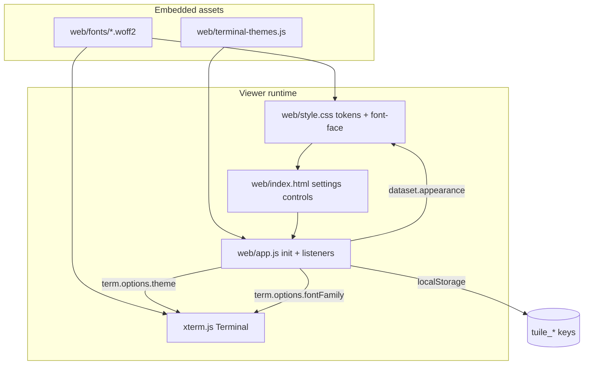

# Viewer Fonts and Themes - Plan

## Goal Capsule

- **Objective:** Ship bundled Nerd Fonts and user-configurable terminal color themes plus app light/dark mode in the Tuile browser viewer, on branch `feat/viewer-fonts-themes` from `main`, landing before `feat/terminal-export` merges.
- **Product authority:** Brainstorm decisions confirmed 2026-07-20; plan scoping confirmed 2026-07-20.
- **Open blockers:** None.

---

## Product Contract

**Product Contract preservation:** R4 narrowed at planning — IBM Plex Mono removed from dropdown when mono CDN is dropped; bundled Fira/JetBrains plain + Nerd faces and System mono satisfy the intent.

### Summary

Self-host Fira Code and JetBrains Mono Nerd Font variants (woff2, OFL) and add two independent viewer settings: **App appearance** (dark | light) for Tuile chrome and **Terminal theme** for xterm ANSI colors across a catalog of popular presets. Both persist in `localStorage` and apply live to the xterm instance. Export integration exposes a stub shared theme API for when `feat/terminal-export` merges.

### Problem Frame

Tuile's browser viewer loads plain Fira Code and JetBrains Mono from Google Fonts CDN. Nerd Font glyphs (nvim statusline icons, devicons) render as tofu. The xterm palette is hardcoded in `web/app.js` with no user control. Export work on `feat/terminal-export` added chrome **background frame** presets (`export-options.js`) — those are not terminal ANSI colors and must not be conflated with this work.

Humans using the viewer for real terminal sessions (nvim, agent CLIs with icon fonts) need offline-capable mono fonts with icon glyphs and familiar color schemes. They also need a light UI option for the surrounding app chrome without forcing the terminal palette to match.

### Key Decisions

- **Independent app and terminal controls.** App appearance (dark | light) and terminal color theme are separate settings. Any combination is valid (e.g. light app + Dracula terminal).
- **Branch from `main`.** Cherry-pick minimal viewer deps from `feat/terminal-export` only when needed (e.g. `web/ligatures.js` is not on `main` today). Do not merge the full export feature.
- **Bundle mono offline; keep Outfit on CDN.** Self-host Nerd and plain mono faces under `web/fonts/`. Keep Google Fonts CDN for the Outfit UI font in v1.
- **No one-click Mixed preset.** Users achieve mixed looks by combining settings manually (e.g. light app + dark terminal). No dedicated shortcut control in v1.
- **Data-driven theme registry.** Terminal themes are a JS data module, not one-off CSS. Colors sourced from official theme repos with license attribution.
- **Export stub now, full parity later.** Define a shared theme lookup API that export compositor can call when export merges; API/server palette mapping is stretch.

### Requirements

**Bundled fonts**

- R1. Self-host woff2 Nerd Font builds (minimum Regular 400): FiraCode Nerd Font and JetBrainsMono Nerd Font, stored under `web/fonts/` with OFL license files and a pinned version file.
- R2. Embed font assets via `web/embed.go` and serve through the existing static handler at `/assets/fonts/...`.
- R3. Register `@font-face` rules in `web/style.css` pointing at bundled font URLs.
- R4. Update the settings font dropdown to include Nerd variants as recommended defaults while retaining plain Fira Code, JetBrains Mono, and system mono options using bundled faces (no Google CDN for mono). IBM Plex Mono is removed — not bundled and no CDN in v1.
- R5. When `feat/terminal-export` merges, export compositor must use the same `fontFamily` as the live viewer. On this branch, ensure the font family value is shared via a common helper or constant export compositor can import if present.

**App appearance**

- R6. Add an **App appearance** control in the settings menu with values `dark` and `light`.
- R7. App appearance applies to Tuile chrome surfaces: sidebar, header/toolbar, settings menu, session list, and non-terminal panels. Implement via CSS custom properties or an equivalent theming layer on `document`/`body`.
- R8. App appearance persists in `localStorage` (e.g. `tuile_app_appearance`) and restores on page load.
- R9. App appearance does not override the terminal ANSI palette. Changing app appearance alone must not mutate `term.options.theme`.

**Terminal color themes**

- R10. Add a **Terminal theme** control in the settings menu. Themes are grouped by family with variant sub-selection where applicable (e.g. Catppuccin: mocha, macchiato, frappe, latte).
- R11. Minimum theme catalog implemented as data (not hardcoded CSS):

| Theme family | Variants |
|--------------|----------|
| Tuile default (current hardcoded palette) | dark |
| One Dark / Atom | dark |
| Dracula | dark |
| Catppuccin | mocha, macchiato, frappe, latte |
| Gruvbox | dark, light |
| Solarized | dark, light |
| Tokyo Night | night, day, storm |
| Rose Pine | main, moon, dawn |
| GitHub | dark, light |

- R12. Each theme entry supplies an xterm.js `ITheme` object: `background`, `foreground`, `cursor`, `cursorAccent`, `selectionBackground`, and `black` through `brightWhite`.
- R13. On theme change, apply `term.options.theme` and refresh the terminal (`term.refresh()` or equivalent). Live preview without page reload.
- R14. Terminal theme persists in `localStorage` (e.g. `tuile_terminal_theme` storing id + variant).
- R15. Truecolor and indexed color from the PTY pass through unchanged. Themes set default palette colors only.

**Integration and export stub**

- R16. Live viewer (`web/app.js`) initializes `new Terminal({ theme })` from the persisted or default theme registry entry.
- R17. Expose a shared lookup (e.g. `getTerminalTheme(id)` / `getActiveTerminalTheme()`) that export compositor and future API export can call. Document the contract; full `internal/export/palette.go` mirror is stretch.
- R18. Do not conflate export chrome background frame presets with terminal ANSI themes.

**Regression guardrails**

- R19. Do not break observe mode layout, canvas renderer, or ligature install path when ligature deps are cherry-picked.
- R20. Preserve WebGL toggle behavior (ligatures off when WebGL on).
- R21. Preserve bootstrap auth and embedded asset serving. Server must still start from project root.

**Tests and docs**

- R22. Add `web/terminal-themes.test.js`: every theme has 16 ANSI colors plus bg/fg; theme ids are unique; objects match xterm `ITheme` shape.
- R23. Run `go test ./...` and `node --test web/*.test.js` green before merge.
- R24. Document bundled fonts (OFL), theme picker usage, independent app vs terminal controls, and light-app + dark-terminal combinations in README or `docs/viewer-themes.md`.

### Key Flows

- F1. **Change terminal theme**
  - **Trigger:** User opens settings and selects a terminal theme.
  - **Steps:** Read theme id from control → lookup registry entry → set `term.options.theme` → `term.refresh()` → persist to `localStorage`.
  - **Outcome:** Terminal colors update immediately; app chrome unchanged unless user also changes app appearance.
  - **Covered by:** R10, R12, R13, R14

- F2. **Toggle app light mode**
  - **Trigger:** User switches App appearance to Light.
  - **Steps:** Set `data-appearance` or CSS variable layer on root → persist `tuile_app_appearance` → terminal theme untouched.
  - **Outcome:** Sidebar, menus, and chrome surfaces render with light palette; terminal keeps its selected ANSI scheme.
  - **Covered by:** R6, R7, R8, R9

- F3. **First visit with bundled Nerd Font**
  - **Trigger:** User selects JetBrainsMono Nerd Font (or default recommendation).
  - **Steps:** `@font-face` loads woff2 from `/assets/fonts/...` → `term.options.fontFamily` updates → nvim statusline icons render.
  - **Outcome:** Nerd glyphs visible without Google Fonts CDN for mono.
  - **Covered by:** R1–R4

### Acceptance Examples

- AE1. **Nerd icons in nvim**
  - **Covers:** R1, R4
  - **Given:** nvim session with statusline nerd icons on `/tmp/tuile-export-readme.md`
  - **When:** Viewer font is JetBrainsMono Nerd Font
  - **Then:** Statusline icons render; no tofu boxes

- AE2. **Light app, dark terminal**
  - **Covers:** R6, R9, R11
  - **Given:** App appearance Light, terminal theme Dracula
  - **When:** User reloads the page
  - **Then:** Chrome is light; terminal background and ANSI colors match Dracula

- AE3. **Theme catalog breadth**
  - **Covers:** R11
  - **Given:** Settings menu open
  - **When:** User browses terminal themes
  - **Then:** At least 8 named families with both light and dark terminal variants available (e.g. Solarized light, Catppuccin latte, GitHub light)

- AE4. **Persistence**
  - **Covers:** R8, R14
  - **Given:** User set App appearance Light and terminal theme Catppuccin Mocha
  - **When:** Hard refresh
  - **Then:** Both settings restore without re-selection

### Success Criteria

- nvim statusline nerd icons render with a Nerd Font selected.
- User can switch among ≥8 named terminal theme families with light and dark variants visible in the UI.
- App light mode works independently of terminal theme.
- Theme, app appearance, and font persist across reload.
- `go build -o bin/tuile ./cmd/tuile` succeeds; viewer works at `http://127.0.0.1:7710/view`.
- PR scoped to fonts + themes + app appearance — no export feature creep.

### Scope Boundaries

**Deferred for later**

- Full `feat/terminal-export` merge and pixel-perfect API vs browser export palette parity
- One-click "Mixed" appearance preset
- All Nerd Font weights and 50+ families
- `tuile fonts install` CLI
- Parsing user local terminal configs (`kitty.conf`, `alacritty.yml`)
- Bundling Outfit UI font offline
- Go theme registry in `internal/export/palette.go` (stretch; JS contract documented first)
- Cherry-pick of `web/ligatures.js` unless verification explicitly requires ligature proof

**Outside this product's identity**

- Importing arbitrary user-uploaded theme files
- Per-session theme overrides from the HTTP API

### Dependencies / Assumptions

- Branch `feat/viewer-fonts-themes` is created from up-to-date `main`.
- `web/ligatures.js` is absent on `main`; Nerd Font icons work without ligatures.
- Export compositor is absent on `main`; R5/R17 are forward-compatible module exports only.
- Official theme color values are taken from upstream palette sources with license comments in the theme data module.
- Binary size increase ~1–4 MB for two woff2 regular faces is acceptable; note in PR description.

---

## Planning Contract

### Key Technical Decisions

- **KTD1 — Theme data module.** Add `web/terminal-themes.js` exporting `TERMINAL_THEMES`, `getTerminalTheme(id)`, `listTerminalThemes()`, and `defaultTerminalThemeId`. Theme ids use `family:variant` keys (e.g. `catppuccin:mocha`, `tuile:default`). Tuile default copies the current hardcoded palette from `web/app.js` so behavior is unchanged for existing users until they switch themes.
- **KTD2 — App appearance via `data-appearance`.** Set `document.documentElement.dataset.appearance` to `dark` or `light`. Extend `web/style.css` with `[data-appearance="light"]` token overrides mirroring the existing `:root` custom properties (`--bg`, `--panel`, `--border`, `--text`, `--muted`, etc.). Update `color-scheme` accordingly. Do not restyle the xterm canvas from CSS.
- **KTD3 — Settings UI shape.** One `<select id="terminal-theme">` with `<optgroup label="Family">` and flat options per variant. One `<select id="app-appearance">` with Dark/Light. Mirror the existing font/size control patterns in `web/index.html` and event wiring style in `web/app.js`.
- **KTD4 — Font bundling.** Download pinned Nerd Fonts release woff2 (Regular 400) for FiraCode and JetBrainsMono plus plain Regular woff2 for the same families from the Nerd Fonts release or upstream OFL sources. Store under `web/fonts/` with `web/fonts/VERSION`, `web/fonts/LICENSE-FiraCode.txt`, `web/fonts/LICENSE-JetBrainsMono.txt`. Use `//go:embed fonts/*` nested embed or explicit font paths in `web/embed.go`.
- **KTD5 — Google Fonts trim.** Replace the combined Google Fonts link in `web/index.html` with Outfit-only CDN. Remove Fira Code and JetBrains Mono from the CDN request.
- **KTD6 — Persistence keys.** `tuile_app_appearance`, `tuile_terminal_theme`, `tuile_font_family` (new — font family is not persisted on `main` today). Default font: JetBrainsMono Nerd Font. Default terminal theme: `tuile:default`. Default app appearance: `dark`.
- **KTD7 — Export forward-compat.** Export `getTerminalTheme` and theme id constants from `web/terminal-themes.js`. Add a short module header comment documenting the contract for `export-compositor.js` post-merge. No changes to `internal/export/` on this branch.

### High-Level Technical Design



### Output Structure

```text
web/
  fonts/
    VERSION
    LICENSE-FiraCode.txt
    LICENSE-JetBrainsMono.txt
    FiraCodeNerdFont-Regular.woff2
    JetBrainsMonoNerdFont-Regular.woff2
    FiraCode-Regular.woff2          # plain mono fallback
    JetBrainsMono-Regular.woff2
  terminal-themes.js
  terminal-themes.test.js
  style.css                         # @font-face + light appearance tokens
  index.html                        # new settings controls
  app.js                            # wire persistence + apply
  embed.go                          # embed fonts/
docs/
  viewer-themes.md                  # user-facing how-to
```

### Assumptions

- Nerd Fonts v3.x release woff2 files are used; exact version pinned in `web/fonts/VERSION`.
- Theme colors are hand-transcribed from official palette docs into `ITheme` shape; truecolor PTY output is unaffected.
- `internal/api/static_test.go` may need a smoke assertion that a bundled font URL returns 200 after embed change.

### Risks and Mitigation

| Risk | Mitigation |
|------|------------|
| Light mode misses a hardcoded dark color in CSS | Grep `web/style.css` for hex literals outside token definitions; prefer `var(--*)` for new edits |
| Binary embed size regression | Document size in PR; only Regular 400 weights |
| Theme id drift vs future export API | Stable `family:variant` ids documented in `docs/viewer-themes.md` |
| IBM Plex removal vs R4 wording | Bundled Fira/JetBrains plain faces satisfy mono choice; system mono replaces Plex |

---

## Implementation Units

### U1. Bundle and embed Nerd Fonts

- **Goal:** Self-hosted woff2 mono fonts available at `/assets/fonts/...`.
- **Requirements:** R1, R2, R3, R5
- **Dependencies:** None
- **Files:** `web/fonts/*`, `web/fonts/VERSION`, `web/fonts/LICENSE-*.txt`, `web/embed.go`, `web/style.css`, `web/index.html`, `NOTICES.md`, `internal/api/static_test.go` (optional font URL smoke)
- **Approach:** Download and commit woff2 binaries. Add `@font-face` rules with `font-display: swap` pointing at `/assets/fonts/...`. Extend `//go:embed` to include `fonts/*`. Trim `web/index.html` Google Fonts link to Outfit only. Update `NOTICES.md` with Nerd Fonts OFL attribution.
- **Patterns to follow:** Existing static asset embed in `web/embed.go`; asset serving via `internal/api/static.go` `GET /assets/`.
- **Test scenarios:**
  - Covers AE1 (font asset available).
  - `go test ./internal/api/...` passes; optional new test requests `/assets/fonts/JetBrainsMonoNerdFont-Regular.woff2` and expects 200.
  - Built viewer loads Nerd face without network requests to `fonts.gstatic.com` for mono.
- **Verification:** `go build -o bin/tuile ./cmd/tuile` succeeds; font files served from embedded FS.

### U2. Terminal theme registry and tests

- **Goal:** Data-driven xterm theme catalog with stable ids and exported lookup API.
- **Requirements:** R10–R17, R22
- **Dependencies:** None
- **Files:** `web/terminal-themes.js`, `web/terminal-themes.test.js`, `web/embed.go` (embed new JS)
- **Approach:** Implement registry per KTD1. Tuile default entry matches current `web/app.js` theme object. Source colors from official theme repositories; add per-family comment with upstream URL and license. Export `getTerminalTheme`, `listTerminalThemes`, `defaultTerminalThemeId`. Add module header documenting export-compositor contract (KTD7).
- **Execution note:** Write `web/terminal-themes.test.js` first — validates shape before wiring UI.
- **Test scenarios:**
  - Every theme id is unique.
  - Every theme has `background`, `foreground`, and all 16 ANSI keys.
  - `getTerminalTheme('tuile:default')` returns the Tuile palette.
  - `getTerminalTheme('missing')` throws or returns undefined per chosen error contract (pick one and test it).
  - Theme count covers all R11 families and variants.
- **Verification:** `node --test web/terminal-themes.test.js` green.

### U3. App appearance light mode CSS

- **Goal:** Light chrome palette toggled independently of terminal colors.
- **Requirements:** R6, R7, R8, R9
- **Dependencies:** None
- **Files:** `web/style.css`
- **Approach:** Implement KTD2. Add `[data-appearance="light"]` block overriding `--bg`, `--bg-elevated`, `--panel`, `--panel-hover`, `--border`, `--border-subtle`, `--text`, `--muted`, and shadow tokens. Set `color-scheme: light` in light block. Audit sidebar, header, settings menu, session list, status bar, and modal/dialog surfaces for hardcoded dark hex — convert to tokens where needed for light parity.
- **Test scenarios:**
  - Test expectation: none — CSS-only; covered by manual UAT and AE2 in U5.
- **Verification:** Toggle `data-appearance="light"` on `<html>` in devtools shows readable light chrome without changing xterm colors.

### U4. Settings menu controls

- **Goal:** User-facing pickers for app appearance, terminal theme, and updated font list.
- **Requirements:** R4, R6, R10
- **Dependencies:** U2 (theme list for options)
- **Files:** `web/index.html`, `web/app.js` (minimal DOM refs only if needed)
- **Approach:** Add `#app-appearance` select (Dark/Light). Add `#terminal-theme` select populated from `listTerminalThemes()` at init (or static optgroups mirroring registry — prefer dynamic populate to avoid drift). Update `#font-family` options: JetBrainsMono Nerd Font (default selected), FiraCode Nerd Font, JetBrains Mono, Fira Code, System mono. Remove IBM Plex Mono per planning assumption.
- **Patterns to follow:** Existing `menu-field` / `menu-label` structure for font and text size controls.
- **Test scenarios:**
  - Test expectation: none — markup only; behavior tested in U5.
- **Verification:** Settings menu renders three new/updated controls without layout breakage.

### U5. Viewer wiring and persistence

- **Goal:** Live apply and restore app appearance, terminal theme, and font family.
- **Requirements:** R4, R8, R9, R13–R16, R19–R21
- **Dependencies:** U1, U2, U3, U4
- **Files:** `web/app.js`
- **Approach:** On load: read `tuile_app_appearance`, `tuile_terminal_theme`, `tuile_font_family` from `localStorage` (KTD6 defaults). Apply appearance to `document.documentElement.dataset.appearance`. Initialize `Terminal` with `theme: getTerminalTheme(savedId).xterm` and saved font family. On change listeners: update term options, `term.refresh()`, persist keys. Remove hardcoded inline theme object from `Terminal` constructor — use registry default. Do not import export modules absent on `main`.
- **Test scenarios:**
  - Covers AE2, AE4.
  - Changing terminal theme updates `term.options.theme` without changing `dataset.appearance`.
  - Changing app appearance updates `dataset.appearance` without changing `term.options.theme`.
  - Font change updates `term.options.fontFamily` and persists `tuile_font_family`.
  - Reload restores all three settings.
- **Verification:** Manual UAT per acceptance examples; `node --test web/*.test.js` and `go test ./...` green.

### U6. Documentation

- **Goal:** User-facing docs for fonts, themes, and independent appearance controls.
- **Requirements:** R24
- **Dependencies:** U5
- **Files:** `docs/viewer-themes.md`, `README.md` (short pointer if appropriate)
- **Approach:** Document bundled fonts (OFL), how to pick terminal theme and app appearance, light-app + dark-terminal example, persistence behavior, and theme id contract for future export. Note binary size impact for PR reviewers.
- **Test scenarios:**
  - Test expectation: none — documentation only.
- **Verification:** Doc renders correctly; links use repo-relative paths.

---

## Verification Contract

| Gate | Command | Applies to |
|------|---------|------------|
| Unit (Go) | `go test ./...` | All |
| Unit (JS) | `node --test web/*.test.js` | U2, U5 |
| Build | `go build -o bin/tuile ./cmd/tuile` | All |
| Manual UAT | nvim session + viewer at `http://127.0.0.1:7710/view` | U1, U5 |
| Static assets | Hard refresh after rebuild (`Ctrl+Shift+R`) | All viewer changes |

**Manual UAT script (from brainstorm):**

1. Build and serve from repo root: `./bin/tuile serve --listen 127.0.0.1:7710 --force`
2. Open nvim session on `/tmp/tuile-export-readme.md`
3. Select JetBrainsMono Nerd Font — confirm statusline nerd icons (AE1)
4. Set App appearance Light + terminal theme Dracula — confirm chrome/terminal independence (AE2)
5. Switch to Solarized Light terminal theme — confirm light terminal variant in catalog (AE3)
6. Hard refresh — confirm persistence (AE4)

---

## Definition of Done

- All R1–R24 requirements satisfied or explicitly deferred in Scope Boundaries.
- Implementation units U1–U6 complete per verification above.
- Acceptance examples AE1–AE4 pass in manual UAT.
- PR scoped to `feat/viewer-fonts-themes` from `main` with no export feature creep.
- PR description notes font binary size impact and OFL attribution.
- `artifact_readiness: implementation-ready` — no blocking open questions.
